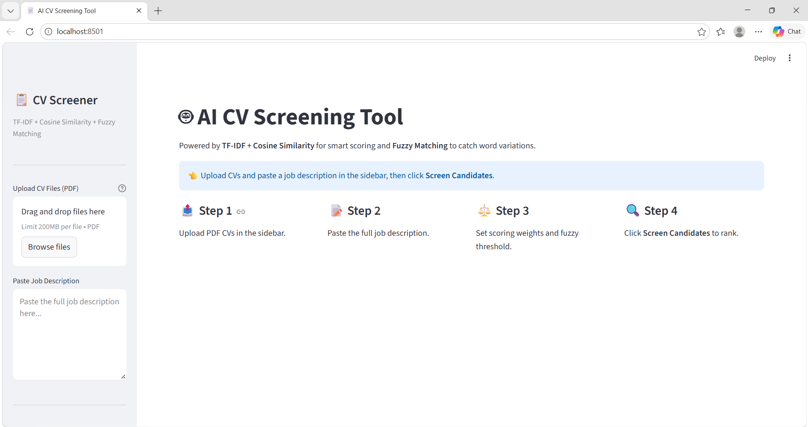
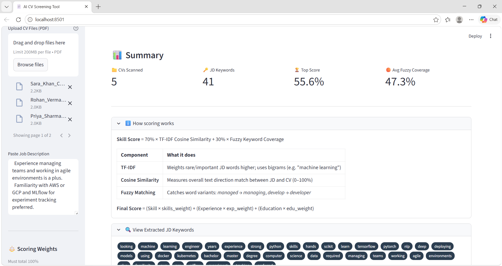

# AI CV Analyzer — Intelligent Resume Screening Tool

> An AI-powered CV screening and ranking application built with Python and Streamlit.  
> Uses **TF-IDF**, **Cosine Similarity**, and **Fuzzy Matching** to rank candidates against a job description — no paid APIs, no black boxes.

---

## Screenshots

### Landing Page


### Candidate Results


---

## What This App Does

Recruiters upload multiple PDF CVs, paste a job description, and the app automatically:

- Extracts keywords from the job description
- Reads and cleans text from every CV
- Scores each candidate using three algorithms working together
- Ranks all candidates from highest to lowest match
- Shows exactly which keywords matched, which were similar, and which were missing
- Exports results as a downloadable CSV

---

## Live Demo

| Step | Action |
|------|--------|
| 1 | Upload one or more PDF CVs |
| 2 | Paste a job description |
| 3 | Set scoring weights (Skills / Experience / Education) |
| 4 | Adjust fuzzy match sensitivity |
| 5 | Click **Screen Candidates** |

---

## Algorithms Used (and Why)

This app was built without any paid AI API. All intelligence comes from three classical NLP algorithms chained together.

### 1. TF-IDF — Term Frequency–Inverse Document Frequency

**What it does:**  
Measures how *important* a word is relative to all documents in the collection.

**Why it's better than simple keyword counting:**  
A word like "the" appears everywhere and means nothing. A word like "Kubernetes" appears rarely and means a lot. TF-IDF automatically weights rare, important words *higher* and common words *lower*.

**Formula:**
```
TF(word) = (times word appears in CV) / (total words in CV)
IDF(word) = log(total CVs / CVs containing the word)
TF-IDF = TF × IDF
```

**How it's used here:**  
Every JD and CV is converted into a TF-IDF vector. The vectorizer also captures **bigrams** (two-word phrases like "machine learning" or "data analysis") so important phrases are not split.

---

### 2. Cosine Similarity

**What it does:**  
Measures how similar two text vectors are, on a scale from 0 (no match) to 1 (identical direction).

**Why cosine, not Euclidean distance:**  
Cosine similarity ignores document length. A short CV and a long CV with the same topic distribution score equally — which is fair.

**Formula:**
```
similarity = (A · B) / (||A|| × ||B||)

Where A = TF-IDF vector of the JD
      B = TF-IDF vector of the CV
```

**How it's used here:**  
The JD vector is compared against every CV vector at once (vectorized, handles 100+ CVs efficiently). The result is a score from 0–100% representing overall semantic alignment between the JD and the CV.

---

### 3. Fuzzy Matching (RapidFuzz)

**What it does:**  
Catches word *variations* that exact matching misses.

| JD says | CV says | Exact match | Fuzzy match |
|---------|---------|-------------|-------------|
| manage | managing | ❌ | ✅ |
| develop | developer | ❌ | ✅ |
| teams | team | ❌ | ✅ |
| analyse | analyze | ❌ | ✅ |

**Algorithm used:**  
Levenshtein ratio (edit distance) via the `rapidfuzz` library — measures how many character edits are needed to turn one word into another, expressed as a percentage.

**How it's used here:**  
For every JD keyword that doesn't exactly appear in the CV, the app checks all CV words for a fuzzy similarity above the configurable threshold (default 82%). Matches are shown as orange badges.

---

### How the Final Score is Calculated

```
Skill Score    = (TF-IDF Cosine Similarity × 70%) + (Fuzzy Keyword Coverage × 30%)

Experience Score = 80  if CV contains: "years", "experience", "worked", "managed", "led"
                   30  otherwise

Education Score  = 80  if CV contains: "bachelor", "master", "degree", "university", "college"
                   20  otherwise

Final Score = (Skill Score   × Skills Weight)
            + (Experience Score × Experience Weight)
            + (Education Score  × Education Weight)

            [Weights set by recruiter via sliders, must total 100%]
```

**Example with default weights (Skills 50%, Experience 30%, Education 20%):**
```
Skill Score    = 72.4%
Experience Score = 80%
Education Score  = 80%

Final Score = (72.4 × 0.50) + (80 × 0.30) + (80 × 0.20)
            = 36.2 + 24.0 + 16.0
            = 76.2%
```

---

## Keyword Badge System

Each candidate card shows three types of keyword badges:

| Badge | Colour | Meaning |
|-------|--------|---------|
| `python` | Green | Found exactly in the CV |
| `teams (team)` | Orange | Fuzzy match — similar word found |
| `kubernetes` | Red | Not found at all |

---

## Tech Stack

| Library | Purpose |
|---------|---------|
| `streamlit` | Web UI — sidebar, sliders, cards, progress bars |
| `pdfplumber` | Extract text from PDF CVs |
| `scikit-learn` | TF-IDF vectorizer + Cosine similarity |
| `rapidfuzz` | Fuzzy word matching (Levenshtein ratio) |
| `pandas` | Sorting, ranking, CSV export |
| `fpdf2` | Generating sample PDF CVs for testing |
| `re` | Text cleaning and keyword extraction |

---

## Project Structure

```
AI_CV_analyzer/
│
├── app.py                   # Main Streamlit application
├── generate_sample_cvs.py   # Script to generate 5 test PDF CVs
├── requirements.txt         # Python dependencies
├── CLAUDE.md                # Project notes
├── README.md                # This file
│
└── sample_cvs/              # Generated test CVs (after running generator)
    ├── Ali_Hassan_CV.pdf
    ├── Priya_Sharma_CV.pdf
    ├── Rohan_Verma_CV.pdf
    ├── Sara_Khan_CV.pdf
    └── James_Okafor_CV.pdf
```

---

## How to Run Locally

### 1. Clone the repository
```bash
git clone https://github.com/your-username/AI-CV-Analyzer.git
cd AI-CV-Analyzer
```

### 2. Install dependencies
```bash
pip install -r requirements.txt
```

### 3. Launch the app
```bash
streamlit run app.py
```

The app opens automatically at `http://localhost:8501`

### 4. Generate sample CVs for testing (optional)
```bash
python generate_sample_cvs.py
```
This creates 5 realistic PDF CVs in `sample_cvs/` with a matching job description printed to the terminal.

---

## Sample Job Description (for testing)

```
We are looking for a Machine Learning Engineer with 3+ years of experience.
Strong Python skills and hands-on experience with scikit-learn, TensorFlow or PyTorch.
Experience with NLP, deep learning, and deploying ML models using Docker and Kubernetes.
Bachelor or master degree in Computer Science or Data Science required.
Experience managing teams and working in agile environments is a plus.
Familiarity with AWS or GCP and MLflow for experiment tracking preferred.
```

**Expected ranking with default weights:**

| Rank | Candidate | Reason |
|------|-----------|--------|
| 1 | Sara Khan | ML engineer, NLP, TF, Docker, Kubernetes, AWS, MSc — near-perfect match |
| 2 | Ali Hassan | Python, ML, scikit-learn, Docker, AWS, MSc — strong match |
| 3 | James Okafor | Strong cloud/DevOps but no ML focus |
| 4 | Priya Sharma | Data analyst, limited ML experience |
| 5 | Rohan Verma | Fresh graduate, basic Python only |

---

## Key Features

- **No paid AI API** — 100% open-source algorithms
- **Batch processing** — all CVs vectorized together, fast at 100+ CVs
- **Adjustable weights** — recruiter decides how much Skills / Experience / Education matters
- **Fuzzy threshold control** — recruiter sets how strict word matching is
- **Three-tier keyword badges** — exact / fuzzy / missing, colour-coded
- **CSV export** — download full ranked results with all sub-scores
- **Error handling** — unreadable PDFs are skipped with a warning

---

## Why This Approach

Most CV screening tools are black boxes — you don't know why a candidate ranked where they did. This app is fully transparent:

- Every score is explained
- Every matched and missing keyword is visible
- Weights are controlled by the recruiter
- The algorithm logic is documented here and inside the code

---

## License

MIT License — free to use, modify, and distribute.
